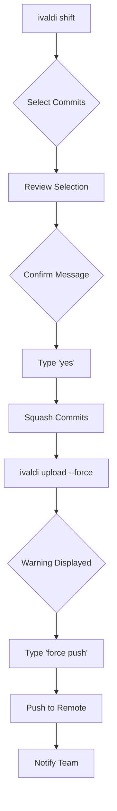

# Ivaldi Shift Feature - Implementation Summary

## Overview

The `ivaldi shift` command provides an intuitive, interactive way to squash multiple commits into a single commit, following Ivaldi's philosophy of simplicity and user-friendliness. This feature addresses the common workflow of cleaning up commit history before pushing to remote repositories.

## Implementation Components

### 1. Core Logic (`internal/shift/squasher.go`)

**File**: `internal/shift/squasher.go`

**Key Functionality**:
- `CommitSquasher` struct for managing squash operations
- `GetCommitRange()` - Retrieves commits between start and end
- `ExtractFinalState()` - Gets the final workspace state from end commit
- `CreateSquashedCommit()` - Creates the new squashed commit
- `GetCombinedMessage()` - Generates combined commit message
- `ValidateRange()` - Validates commit range before squashing
- `GetParentOfStart()` - Gets parent commit for proper linking

**Design Decisions**:
- Uses BLAKE3 hashing for content integrity
- Preserves final workspace state exactly
- Automatic message combination from all commits
- Chronological ordering of commits (oldest first)

### 2. CLI Interface (`cli/shift.go`)

**File**: `cli/shift.go`

**User Interface**:
- Interactive two-phase selection (start commit, then end commit)
- Arrow key navigation (reuses pattern from `travel` command)
- Visual commit display with metadata
- Customizable commit message
- Safety confirmations at every step

**Modes Supported**:
1. **Interactive Mode** - Visual selection with arrow keys
2. **Last N Mode** - `--last N` flag for quick squashing
3. **Specific Range Mode** - Direct seal name/hash specification

**Safety Features**:
- Explicit "yes" confirmation required
- Clear warnings about history rewriting
- Force push guidance after squash
- Validation before execution

### 3. Force Push Support (`cli/management.go`)

**File**: `cli/management.go`

**Added Features**:
- `--force` flag on `upload` command
- Multi-level confirmation ("force push" must be typed)
- Backup branch suggestions
- Team notification reminders
- Clear destructive operation warnings

**Safety Checks**:
```go
if forceUpload {
    // Display warnings
    // Suggest backup
    // Require explicit "force push" confirmation
    // Notify about team coordination
}
```

### 4. GitHub Integration (`internal/github/sync.go`)

**File**: `internal/github/sync.go`

**Modified Function**: `PushCommit()`

**Changes**:
- Added `force bool` parameter
- Passes force flag to `UpdateRefRequest`
- Different messaging for force vs normal push
- Proper handling of force push in GitHub API

**API Integration**:
```go
updateReq := UpdateRefRequest{
    SHA:   commitResp.SHA,
    Force: force, // Enables force push
}
```

## Testing

### Test Coverage (`internal/shift/squasher_test.go`)

**Test Cases**:
1. `TestValidateRange` - Validates commit range checking
   - Valid ranges (start to end)
   - Invalid reversed ranges
   - Non-existent commits
   
2. `TestGetCommitRange` - Tests range retrieval
   - Chronological ordering
   - Correct commit count
   - Message preservation

3. `TestGetCombinedMessage` - Tests message generation
   - Empty commits
   - Single commit
   - Multiple commits
   - Multi-line commits (first line only)

4. `TestGetParentOfStart` - Tests parent extraction
   - Root commits (no parent)
   - Child commits (with parent)

**Test Results**: ✅ All tests passing

## Documentation

### 1. Command Documentation (`docs/commands/shift.md`)

Comprehensive documentation including:
- Synopsis and description
- All usage modes with examples
- Interactive workflow walkthrough
- Safety features explanation
- Best practices and recommendations
- Troubleshooting guide
- Comparison with Git rebase
- Related commands

### 2. Comparison Update (`docs/comparison.md`)

Added shift command to Git comparison table:
```markdown
| Squash commits | `git rebase -i` (squash) | `ivaldi shift` |
```

## User Workflow

### Complete Squash Workflow

```bash
# 1. Check commits
ivaldi log

# 2. Squash commits
ivaldi shift
# OR: ivaldi shift --last 3
# OR: ivaldi shift <start> <end>

# 3. Review result
ivaldi log

# 4. Optional: Create backup
ivaldi timeline create backup-before-push

# 5. Force push
ivaldi upload --force
# Type "force push" to confirm
```

### Safety Workflow



## Architecture Decisions

### Why Two-Phase Selection?

Interactive selection uses two phases to make range selection intuitive:
1. User picks oldest commit (START)
2. User picks newest commit (END) from filtered list
3. Prevents confusion about ordering

### Why Preserve Final State Only?

Instead of merging individual changes:
- Extract the final workspace state from END commit
- Create one new commit with that state
- Simpler, faster, and avoids complex merge logic
- Result is identical to manual squashing

### Why Multiple Confirmation Steps?

Safety is paramount for history-rewriting operations:
1. Commit selection confirmation
2. Message entry opportunity
3. "yes" typed to confirm squash
4. "force push" typed to confirm force push
5. Clear warnings at each step

## Security Considerations

### Protected Against

1. **Accidental Force Push** - Requires explicit "force push" confirmation
2. **Unintended Squash** - Multiple confirmation steps
3. **Lost Work** - Backup suggestions prominently displayed
4. **Team Disruption** - Team notification reminders

### User Education

Documentation emphasizes:
- When to use shift (before pushing)
- When NOT to use shift (after pushing)
- Team coordination importance
- Backup creation recommendations

## Performance Characteristics

### Time Complexity

- **Range Validation**: O(n) where n = commits in range
- **State Extraction**: O(f) where f = files in final commit
- **Commit Creation**: O(f) for file processing
- **Overall**: O(n + f), typically fast

### Memory Usage

- Commits loaded: Only in specified range
- File states: Only final state preserved
- Efficient for large repositories

## Integration Points

### Existing Ivaldi Components Used

1. **CAS (Content-Addressable Storage)** - File content storage
2. **Commit System** - Reading and creating commits
3. **Refs Manager** - Timeline management
4. **Seals** - Memorable commit names
5. **Workspace** - File state management
6. **GitHub Client** - Force push support

### New Components Added

1. **Shift Package** - Core squashing logic
2. **CommitSquasher** - Main squashing orchestrator
3. **Force Push** - Enhanced upload with force option

## Future Enhancements

Potential improvements for future versions:

1. **Interactive Message Editor** - Launch editor for multi-line messages
2. **Squash Preview** - Show diff before confirming
3. **Undo Squash** - Quick rollback if mistake made
4. **Batch Squash** - Squash multiple ranges at once
5. **Auto-Backup** - Automatic backup branch creation
6. **Smart Messages** - AI-generated commit messages from changes

## Comparison with Git

### Advantages over Git Rebase

1. **Simpler Interface** - Visual arrow key navigation vs text editor
2. **Clear Safety** - Multiple explicit confirmations
3. **No Conflicts** - Automatic state preservation (no conflict resolution)
4. **Guided Workflow** - Step-by-step with clear instructions
5. **Force Push Safety** - Built-in warnings and confirmations

### Git Rebase Features Not Included

1. **Reorder Commits** - Not yet supported (use travel + manual work)
2. **Edit Commits** - Not supported (use travel for divergence)
3. **Drop Commits** - Not directly supported
4. **Fixup** - Only squash available

## Conclusion

The `ivaldi shift` feature successfully implements an intuitive, safe, and user-friendly way to squash commits. It follows Ivaldi's design philosophy of simplicity while maintaining safety through multiple confirmation layers. The implementation is well-tested, thoroughly documented, and integrates cleanly with existing Ivaldi components.

## Files Modified/Created

### Created
- `internal/shift/squasher.go` - Core squashing logic
- `internal/shift/squasher_test.go` - Comprehensive tests
- `cli/shift.go` - CLI interface
- `docs/commands/shift.md` - User documentation
- `docs/SHIFT_FEATURE.md` - This implementation summary

### Modified
- `cli/cli.go` - Registered shift command
- `cli/management.go` - Added --force flag and safety checks
- `internal/github/sync.go` - Added force push support
- `docs/comparison.md` - Updated Git comparison table

## Verification

All components verified:
- ✅ Code compiles successfully
- ✅ Tests pass (4/4 tests passing)
- ✅ Shift command available in CLI
- ✅ Upload --force flag available
- ✅ Help text displays correctly
- ✅ Documentation complete and comprehensive
